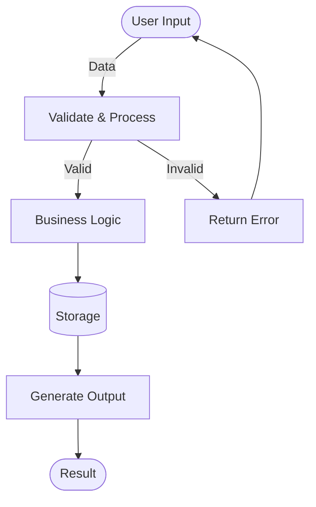

## System Data Flow

```mermaid
graph TD
    Start([User Input]) -->|Data| Process["Validate & Process"]
    Process -->|Valid| Transform["Business Logic"]
    Process -->|Invalid| Error["Return Error"]
    Transform --> Storage[("Storage")]
    Storage --> Output["Generate Output"]
    Output --> End([Result])
    Error --> Start
```

Update this diagram when adding data-processing stages or changing the core flow.
