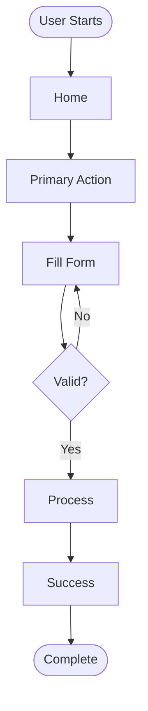

## User Workflow

```mermaid
graph TD
    Start([User Starts]) --> Landing["Home"]
    Landing --> Action["Primary Action"]
    Action --> Form["Fill Form"]
    Form --> Validate{Valid?}
    Validate -->|Yes| Process["Process"]
    Validate -->|No| Form
    Process --> Success["Success"]
    Success --> End([Complete])
```

Update this diagram when adding user interaction paths or changing the UX flow.
